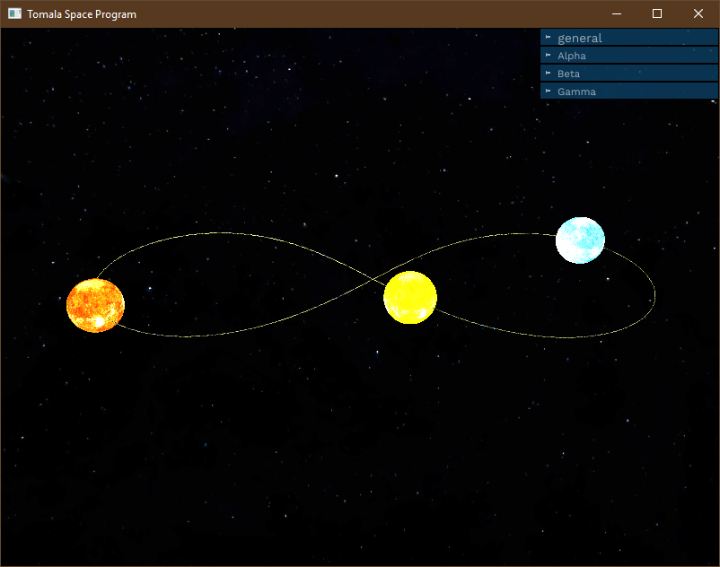

# Tomala Space Program

A solver for the gravitational three body problem using the Runge-Kutta method written in rust.
It was written for a numerical methods course at AGH UST Kraków.
Uses the [kiss3d](https://github.com/sebcrozet/kiss3d) library along with [conrod](https://github.com/PistonDevelopers/conrod)
for the interface.

